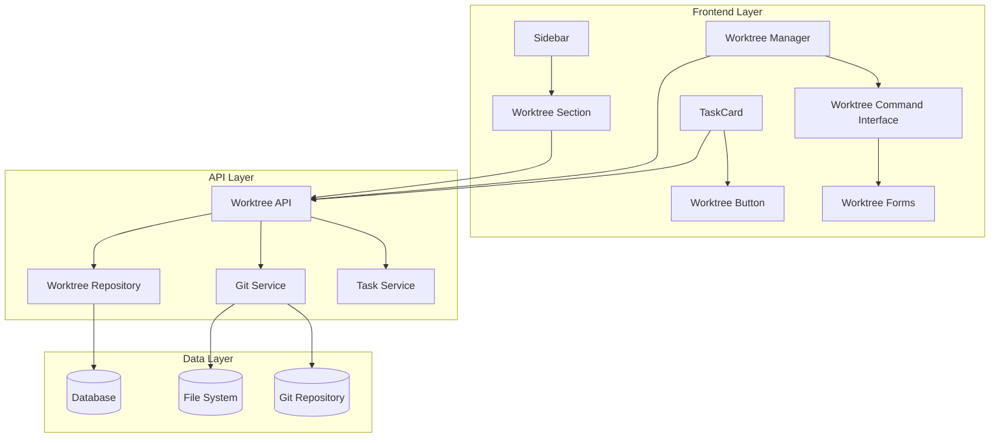

# Git Worktree Integration Design

## Overview

Thiết kế hệ thống tích hợp Git worktree vào task management system, bao gồm backend API để thực hiện git operations, frontend components để quản lý worktree, và database schema để lưu trữ worktree metadata và task linking.

## Architecture



## Components and Interfaces

### 1. Backend Components

#### GitWorktreeService
```typescript
interface GitWorktreeService {
  // Core worktree operations
  createWorktree(name: string, branch: string, basePath?: string): Promise<Worktree>
  deleteWorktree(worktreePath: string, force?: boolean): Promise<void>
  listWorktrees(): Promise<Worktree[]>
  getWorktreeStatus(worktreePath: string): Promise<WorktreeStatus>
  
  // Branch operations
  mergeWorktree(worktreePath: string, targetBranch: string): Promise<MergeResult>
  pushWorktree(worktreePath: string): Promise<void>
  pullWorktree(worktreePath: string): Promise<void>
  
  // Validation
  validateWorktreeName(name: string): ValidationResult
  validateWorktreePath(path: string): ValidationResult
}
```

#### WorktreeRepository
```typescript
interface WorktreeRepository {
  create(worktree: CreateWorktreeDto): Promise<Worktree>
  findAll(): Promise<Worktree[]>
  findById(id: string): Promise<Worktree | null>
  findByTaskId(taskId: string): Promise<Worktree[]>
  update(id: string, updates: Partial<Worktree>): Promise<Worktree>
  delete(id: string): Promise<void>
  linkToTask(worktreeId: string, taskId: string): Promise<void>
  unlinkFromTask(worktreeId: string, taskId: string): Promise<void>
}
```

### 2. Frontend Components

#### WorktreeButton Component
```typescript
interface WorktreeButtonProps {
  task: Task
  onWorktreeCreated?: (worktree: Worktree) => void
}

// Hiển thị trong TaskCard và TaskDetail
// - "Create Worktree" nếu chưa có worktree
// - "Open Worktree" nếu đã có worktree
// - Loading state khi đang tạo
```

#### WorktreeManager Component
```typescript
interface WorktreeManagerProps {
  isOpen: boolean
  onClose: () => void
  initialWorktreeId?: string
}

// Modal/Page component với tabs:
// - Overview: List all worktrees
// - Commands: Git worktree commands interface
// - Settings: Worktree preferences
```

#### WorktreeSidebar Component
```typescript
interface WorktreeSidebarProps {
  worktrees: Worktree[]
  onWorktreeSelect: (worktree: Worktree) => void
  onRefresh: () => void
}

// Hiển thị trong sidebar dưới Statistics
// - Compact list view
// - Status indicators
// - Quick actions menu
```

#### WorktreeCommandInterface Component
```typescript
interface WorktreeCommandInterfaceProps {
  onCommandExecute: (command: WorktreeCommand) => Promise<CommandResult>
}

// Tương tự Send Command to Claude interface
// - Predefined command templates
// - Form inputs for parameters
// - Real-time command output
// - Command history
```

### 3. Data Models

#### Worktree Model
```typescript
interface Worktree {
  id: string
  name: string
  path: string
  branch: string
  baseBranch: string
  taskIds: string[]
  status: WorktreeStatus
  createdDate: string
  lastAccessedDate: string
  isActive: boolean
  metadata: WorktreeMetadata
}

interface WorktreeStatus {
  isClean: boolean
  modifiedFiles: number
  stagedFiles: number
  untrackedFiles: number
  aheadCount: number
  behindCount: number
  hasConflicts: boolean
  lastStatusCheck: string
}

interface WorktreeMetadata {
  createdBy: string
  description?: string
  tags: string[]
  autoCleanup: boolean
  cleanupAfterDays?: number
}
```

#### WorktreeCommand Model
```typescript
interface WorktreeCommand {
  id: string
  name: string
  description: string
  template: string
  parameters: CommandParameter[]
  category: 'create' | 'delete' | 'merge' | 'sync' | 'status'
}

interface CommandParameter {
  name: string
  type: 'string' | 'select' | 'boolean' | 'path'
  required: boolean
  defaultValue?: any
  options?: string[]
  validation?: string
}
```

## Data Models

### Database Schema

#### worktrees table
```sql
CREATE TABLE worktrees (
  id VARCHAR(255) PRIMARY KEY,
  name VARCHAR(255) NOT NULL,
  path VARCHAR(500) NOT NULL UNIQUE,
  branch VARCHAR(255) NOT NULL,
  base_branch VARCHAR(255) NOT NULL,
  is_active BOOLEAN DEFAULT true,
  created_date DATETIME NOT NULL,
  last_accessed_date DATETIME,
  metadata JSON,
  INDEX idx_name (name),
  INDEX idx_branch (branch),
  INDEX idx_active (is_active)
);
```

#### worktree_tasks table (many-to-many relationship)
```sql
CREATE TABLE worktree_tasks (
  worktree_id VARCHAR(255),
  task_id VARCHAR(255),
  linked_date DATETIME NOT NULL,
  PRIMARY KEY (worktree_id, task_id),
  FOREIGN KEY (worktree_id) REFERENCES worktrees(id) ON DELETE CASCADE,
  FOREIGN KEY (task_id) REFERENCES tasks(id) ON DELETE CASCADE
);
```

#### worktree_status table
```sql
CREATE TABLE worktree_status (
  worktree_id VARCHAR(255) PRIMARY KEY,
  is_clean BOOLEAN DEFAULT true,
  modified_files INT DEFAULT 0,
  staged_files INT DEFAULT 0,
  untracked_files INT DEFAULT 0,
  ahead_count INT DEFAULT 0,
  behind_count INT DEFAULT 0,
  has_conflicts BOOLEAN DEFAULT false,
  last_check_date DATETIME NOT NULL,
  FOREIGN KEY (worktree_id) REFERENCES worktrees(id) ON DELETE CASCADE
);
```

## Error Handling

### Error Categories

1. **Git Operation Errors**
   - Repository not found
   - Branch doesn't exist
   - Merge conflicts
   - Permission denied
   - Network connectivity issues

2. **File System Errors**
   - Path already exists
   - Insufficient disk space
   - Permission denied
   - Invalid path format

3. **Validation Errors**
   - Invalid worktree name
   - Duplicate worktree name
   - Invalid branch name
   - Missing required parameters

4. **Business Logic Errors**
   - Task already has worktree
   - Worktree has uncommitted changes
   - Cannot delete active worktree
   - Circular dependency in merge

### Error Handling Strategy

```typescript
interface WorktreeError {
  code: string
  message: string
  details?: any
  suggestions?: string[]
  recoverable: boolean
}

// Error codes
enum WorktreeErrorCode {
  GIT_COMMAND_FAILED = 'GIT_COMMAND_FAILED',
  PATH_ALREADY_EXISTS = 'PATH_ALREADY_EXISTS',
  UNCOMMITTED_CHANGES = 'UNCOMMITTED_CHANGES',
  BRANCH_NOT_FOUND = 'BRANCH_NOT_FOUND',
  PERMISSION_DENIED = 'PERMISSION_DENIED',
  NETWORK_ERROR = 'NETWORK_ERROR',
  VALIDATION_ERROR = 'VALIDATION_ERROR'
}
```

## Testing Strategy

### Unit Tests
- GitWorktreeService methods
- WorktreeRepository CRUD operations
- Validation functions
- Error handling scenarios

### Integration Tests
- API endpoints with real git operations
- Database operations with transactions
- File system operations with cleanup

### E2E Tests
- Complete worktree creation workflow
- Task-worktree linking flow
- Worktree deletion with safety checks
- Command interface operations

### Test Data Setup
```typescript
// Mock git repository structure
const testRepoStructure = {
  branches: ['main', 'develop', 'feature/test'],
  commits: ['abc123', 'def456', 'ghi789'],
  worktrees: [
    { name: 'main-worktree', branch: 'main', path: '/tmp/main-wt' },
    { name: 'feature-worktree', branch: 'feature/test', path: '/tmp/feature-wt' }
  ]
}
```

## Security Considerations

1. **Path Validation**: Prevent directory traversal attacks
2. **Command Injection**: Sanitize all git command parameters
3. **File Permissions**: Ensure proper file system permissions
4. **User Authorization**: Verify user permissions for git operations
5. **Resource Limits**: Prevent excessive worktree creation
6. **Cleanup**: Automatic cleanup of orphaned worktrees

## Performance Considerations

1. **Lazy Loading**: Load worktree status on demand
2. **Caching**: Cache git status for short periods
3. **Background Jobs**: Periodic cleanup of stale worktrees
4. **Batch Operations**: Group multiple git operations
5. **Resource Monitoring**: Monitor disk space usage
6. **Debouncing**: Debounce rapid status check requests

## Deployment Considerations

1. **Git Dependencies**: Ensure git is available on server
2. **File System**: Adequate disk space for worktrees
3. **Permissions**: Proper file system permissions
4. **Backup**: Exclude worktree directories from backups
5. **Monitoring**: Monitor worktree creation/deletion rates
6. **Configuration**: Configurable worktree base paths