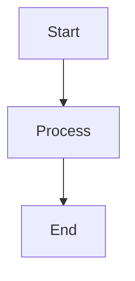
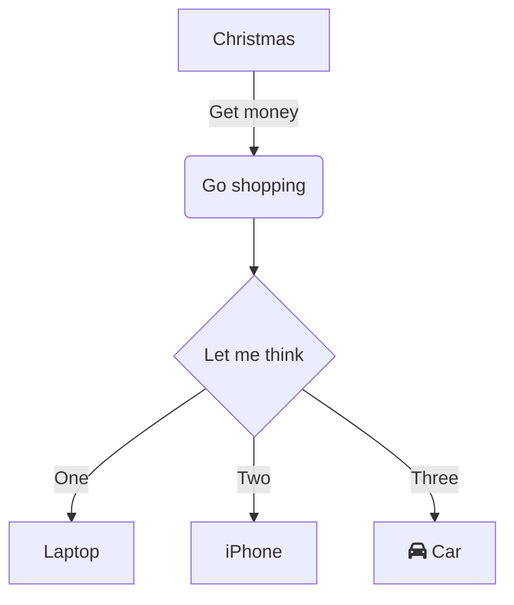
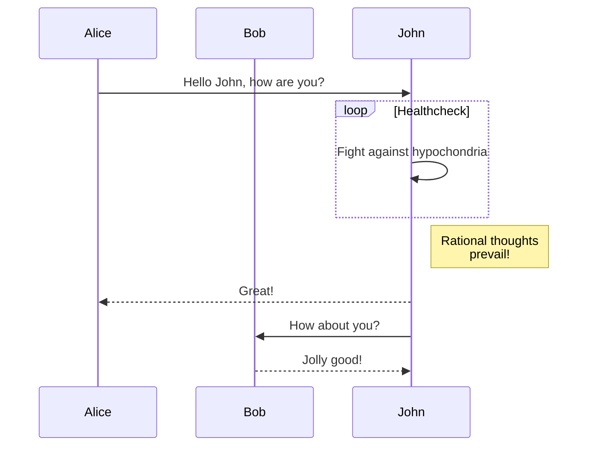
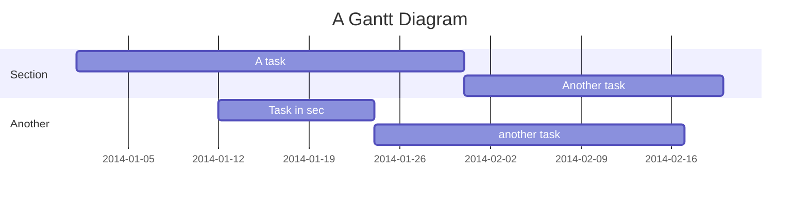
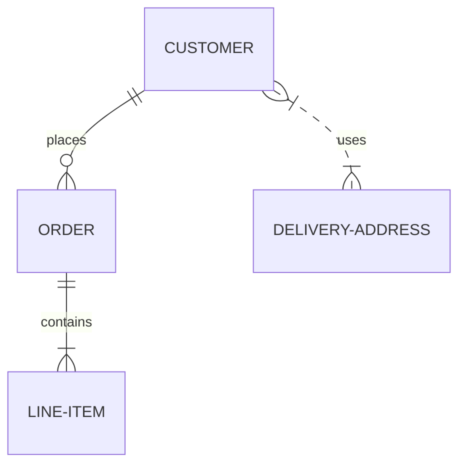

# Mermaid Diagrams Integration

Tính năng mới này cho phép hiển thị Mermaid diagrams trong Sprint, Document, Milestone và Decision files.

## Cách sử dụng

### 1. HTML Format (như bạn đã sử dụng)

```html
<!DOCTYPE html>
<html>
<head>
    <script src="https://cdn.jsdelivr.net/npm/mermaid/dist/mermaid.min.js"></script>
</head>
<body>
    <div class="mermaid">
        graph TD
            A[Start] --> B[Process]
            B --> C[End]
    </div>
    <script>
        mermaid.initialize({ startOnLoad: true });
    </script>
</body>
</html>
```

### 2. Standard Markdown Format

````markdown

````

## Các loại diagram được hỗ trợ

### Flowchart


### Sequence Diagram


### Gantt Chart


### Entity Relationship Diagram


## Tính năng

- ✅ **Dual Format Support**: Hỗ trợ cả HTML format và standard markdown format
- ✅ **Theme Integration**: Tự động thay đổi theo dark/light theme
- ✅ **Error Handling**: Hiển thị lỗi chi tiết khi syntax không đúng
- ✅ **Loading States**: Hiển thị loading indicator khi render diagram
- ✅ **Responsive Design**: Diagrams tự động scale theo screen size
- ✅ **Multiple Diagrams**: Hỗ trợ nhiều diagrams trong cùng một file
- ✅ **Mixed Content**: Kết hợp markdown content và diagrams

## Components được cập nhật

- `SprintDetail.tsx` - Hiển thị diagrams trong sprint files
- `DocumentationDetail.tsx` - Hiển thị diagrams trong documentation
- `MilestoneDetail.tsx` - Hiển thị diagrams trong milestones
- `DecisionDetail.tsx` - Hiển thị diagrams trong decisions

## Files mới

- `MermaidRenderer.tsx` - Component render Mermaid diagrams
- `MarkdownWithMermaid.tsx` - Component parse và render markdown + Mermaid
- `mermaid.css` - Styling cho Mermaid diagrams

## Cách test

1. Khởi động web interface: `backlog browser`
2. Tạo hoặc edit một sprint/document
3. Thêm Mermaid diagram theo format HTML hoặc markdown
4. Save và xem kết quả trong preview mode
5. Test theme switching (dark/light mode)

## Performance Notes

- Mermaid library được load lazy (chỉ khi cần)
- Diagrams được cache để tránh re-render không cần thiết
- Error boundaries để tránh crash toàn bộ page khi có lỗi diagram

## Browser Support

- Chrome/Edge: Full support
- Firefox: Full support  
- Safari: Full support
- Mobile browsers: Responsive support