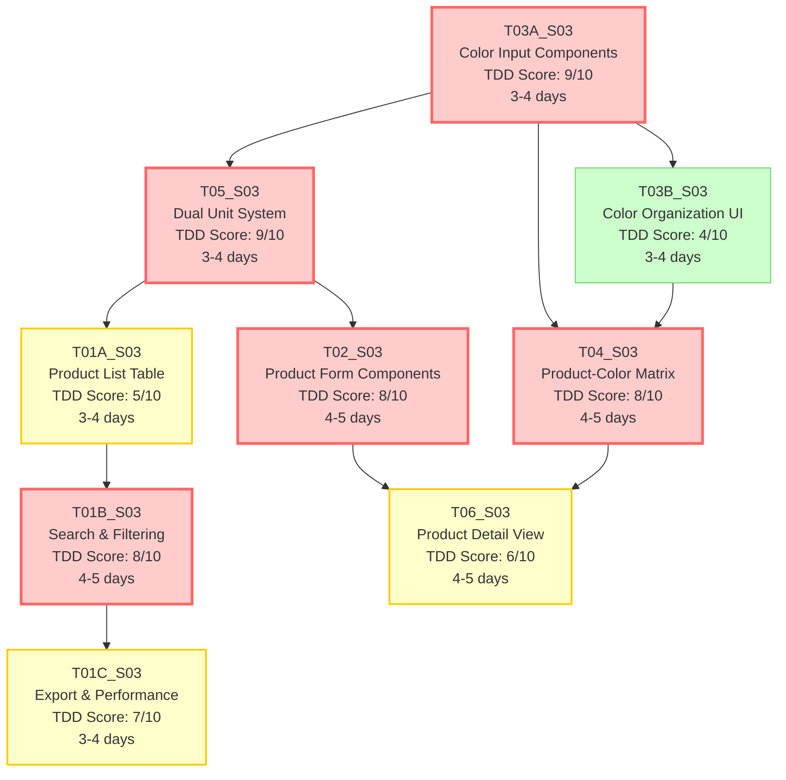

# S03_M02_Product_Catalog - Task Execution Diagram

## Sprint Overview
**Sprint**: S03_M02_Product_Catalog
**Total Tasks**: 9
**Average TDD Score**: 7.1/10
**Execution Strategy**: TDD-First Sprint with Strategic Implementation

---

## Task Priority Matrix

### 🔴 High Priority TDD Tasks (Score >= 8)

| Task ID | Task Name | TDD Score | Complexity | Type | Dependencies | Estimated Days |
|---------|-----------|-----------|------------|------|--------------|----------------|
| T03A_S03 | Color Input Components | 9/10 | Medium | Business Logic | None | 3-4 |
| T05_S03 | Dual Unit System Interface | 9/10 | Medium | Business Logic | Measurement utilities | 3-4 |
| T01B_S03 | Search and Filtering System | 8/10 | Medium | Business Logic | T01A_S03 | 4-5 |
| T02_S03 | Product Form Components | 8/10 | Medium | Business Logic + UI | T05_S03 | 4-5 |
| T04_S03 | Product-Color Matrix | 8/10 | Medium | Business Logic | T03A_S03, T03B_S03 | 4-5 |

### 🟡 Medium Priority TDD Tasks (Score 5-7)

| Task ID | Task Name | TDD Score | Complexity | Type | Dependencies | Estimated Days |
|---------|-----------|-----------|------------|------|--------------|----------------|
| T01C_S03 | Export & Performance | 7/10 | Low | Business Logic | T01A_S03, T01B_S03 | 3-4 |
| T06_S03 | Product Detail View | 6/10 | Medium | Business Logic + UI | T02_S03, T04_S03 | 4-5 |
| T01A_S03 | Product List Table | 5/10 | Medium | UI/Frontend | T05_S03 | 3-4 |

### 🟢 Low Priority TDD Tasks (Score < 5)

| Task ID | Task Name | TDD Score | Complexity | Type | Dependencies | Estimated Days |
|---------|-----------|-----------|------------|------|--------------|----------------|
| T03B_S03 | Color Organization UI | 4/10 | Medium | UI/Frontend | T03A_S03 | 3-4 |

---

## Execution Flow Diagram

---

## Parallel Execution Opportunities

### Phase 1: Foundation Layer (Week 1)
**Parallel Track A**: T03A_S03 (Color Input Components)
- Pure business logic with no dependencies
- High TDD priority - implement validation/conversion functions first
- Critical for color management throughout sprint

**Parallel Track B**: T05_S03 (Dual Unit System Interface)
- Independent measurement system functionality
- High TDD priority - focus on conversion algorithms
- Required by multiple other tasks

**Estimated Duration**: 4-5 days (parallel execution)

### Phase 2: Core UI Development (Week 2)
**Parallel Track A**: T03B_S03 (Color Organization UI) + T01A_S03 (Product List Table)
- UI-focused tasks with minimal interdependencies
- Can leverage completed foundation components

**Parallel Track B**: T02_S03 (Product Form Components)
- Depends on T05_S03 completion
- High TDD priority for validation logic
- Critical path for remaining tasks

**Estimated Duration**: 4-5 days (parallel execution)

### Phase 3: Advanced Features (Week 3)
**Parallel Track A**: T01B_S03 (Search and Filtering System)
- High complexity search algorithms
- High TDD priority
- Integrates with completed table component

**Parallel Track B**: T04_S03 (Product-Color Matrix)
- Complex business logic for availability management
- Requires color components from Phase 1-2

**Estimated Duration**: 5-6 days (parallel execution)

### Phase 4: Enhancement & Polish (Week 4)
**Sequential Execution**: T01C_S03 → T06_S03
- Export functionality builds on search/filtering
- Detail view integrates multiple completed components
- Focus on performance optimization and final integration

**Estimated Duration**: 4-5 days (sequential)

---

## Critical Path Analysis

**Primary Critical Path (16-18 days)**:
T03A_S03 → T04_S03 → T06_S03 → Project Completion

**Alternative Critical Path (17-19 days)**:
T05_S03 → T02_S03 → T06_S03 → Project Completion

**Optimization Strategies**:
1. Prioritize T03A_S03 and T05_S03 in parallel (Week 1)
2. Ensure T02_S03 development starts immediately after T05_S03
3. Begin T04_S03 as soon as color components are ready
4. Overlap T01C_S03 with early phases of T06_S03

---

## Resource Allocation Strategy

### Team Composition Recommendations

**TDD Specialist Team (5 tasks - 56% of sprint)**:
- Assign developers with strong unit testing experience
- Focus on: T03A_S03, T05_S03, T01B_S03, T02_S03, T04_S03
- Allocate 40% additional time for test-first development

**UI/Frontend Team (2 tasks - 22% of sprint)**:
- Assign developers with accessibility and responsive design expertise
- Focus on: T03B_S03, T01A_S03
- Emphasize integration testing over unit testing

**Full-Stack Integration Team (2 tasks - 22% of sprint)**:
- Assign senior developers for complex integration work
- Focus on: T01C_S03, T06_S03
- Balance TDD for business logic with integration testing

### Timeline Distribution

**Sprint Duration**: 4 weeks (20 working days)
- **Week 1**: Foundation (T03A_S03, T05_S03) - 2 parallel tracks
- **Week 2**: Core UI (T03B_S03, T01A_S03, T02_S03) - 2-3 parallel tracks
- **Week 3**: Advanced Features (T01B_S03, T04_S03) - 2 parallel tracks
- **Week 4**: Enhancement & Integration (T01C_S03, T06_S03) - Sequential

---

## Risk Mitigation

### High-Risk Dependencies

**Color System Integration Risk**:
- T03A_S03 failure impacts T03B_S03 and T04_S03
- **Mitigation**: Start T03A_S03 immediately, implement core validation first
- **Contingency**: Prepare mock color data for dependent tasks

**Measurement System Risk**:
- T05_S03 conversion accuracy affects T01A_S03 and T02_S03
- **Mitigation**: Extensive unit testing for conversion algorithms
- **Contingency**: Fallback to single-unit display if conversion fails

**Performance Risk (T01C_S03)**:
- Export and virtualization requirements may exceed time estimates
- **Mitigation**: Start performance testing early, implement basic version first
- **Contingency**: Reduce scope to CSV-only export if needed

### Quality Assurance Strategy

**TDD Enforcement Checkpoints**:
- Day 2: T03A_S03 validation functions must have 90% test coverage
- Day 4: T05_S03 conversion algorithms must pass precision tests
- Day 8: T02_S03 form validation schemas must have comprehensive test suite
- Day 12: T01B_S03 search algorithms must pass performance benchmarks

**Integration Testing Milestones**:
- Day 10: Color input + organization integration test
- Day 14: Product form + dual unit system integration test
- Day 16: Search + filtering + table integration test
- Day 18: Full product catalog workflow end-to-end test

---

## Success Metrics

### TDD Targets
- **High-TDD Tasks**: 90% code coverage, <5% production bug rate
- **Medium-TDD Tasks**: 70% code coverage, <10% production bug rate
- **Low-TDD Tasks**: Integration test coverage, accessibility compliance

### Performance Goals
- **T01A_S03**: <500ms table rendering for 1000+ products
- **T01B_S03**: <300ms search response time
- **T01C_S03**: Export processing for 10,000+ products in <30 seconds
- **T05_S03**: Real-time conversion updates <50ms

### Quality Gates
- All high-TDD tasks pass comprehensive unit test suites
- All UI components meet WCAG 2.1 AA accessibility standards
- Performance benchmarks met for all optimization tasks
- Zero critical bugs in color validation and unit conversion systems

### Business Value Delivery
- Complete product catalog management functionality
- Dual measurement system support for international operations
- Advanced search and filtering for large product inventories
- Efficient bulk operations for product-color availability management
