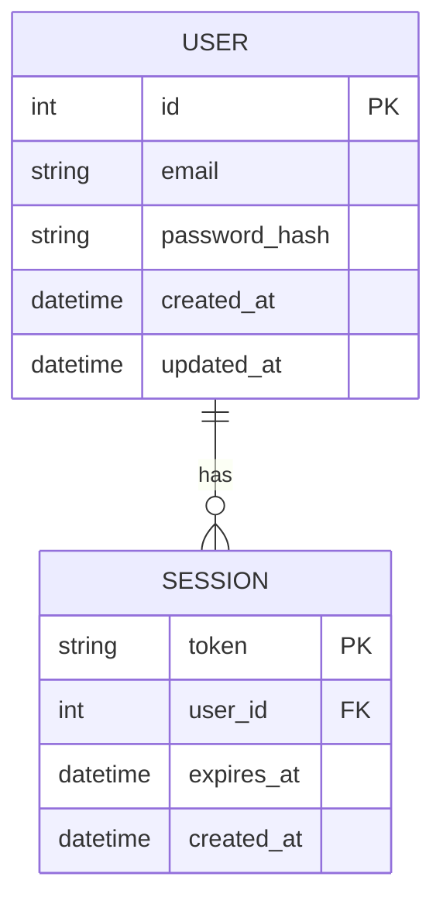
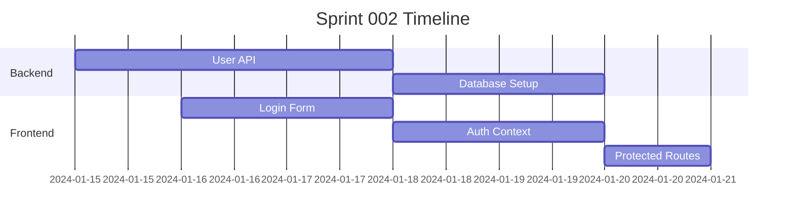

## Sprint Overview

This sprint focuses on implementing the user authentication flow and database schema.

## Architecture Diagram

<!DOCTYPE html>
<html>
<head>
    
</head>
<body>
    

graph TD
    %% Phase 1: Foundation (Week 1)
    T01[T01_S02 Database Schema 🟢 TDD Score: 4/10 ⏱️ 4-6h] --> T02[T02_S02 Service Layer 🔴 TDD Score: 9/10 ⏱️ 8-12h]
    T01 --> T06[T06_S02 Address Management 🟡 TDD Score: 7/10 ⏱️ 4-6h]

    %% Phase 2: Core Business Logic (Week 1-2)
    T02 --> T04[T04_S02 Code Generation 🔴 TDD Score: 8/10 ⏱️ 3-4h]
    T02 --> T05[T05_S02 Search System 🟡 TDD Score: 6/10 ⏱️ 6-8h]
    T02 --> T10[T10_S02 Order History 🟡 TDD Score: 5/10 ⏱️ 6-8h]

    %% Phase 3: API Layer (Week 2)
    T02 --> T03[T03_S02 API Endpoints 🟡 TDD Score: 7/10 ⏱️ 6-8h]
    T04 --> T03

    %% Phase 4: UI Components (Week 2-3)
    T03 --> T08[T08_S02 Form Components 🟢 TDD Score: 4/10 ⏱️ 8-10h]
    T03 --> T07[T07_S02 List Component 🟢 TDD Score: 3/10 ⏱️ 6-8h]
    T05 --> T07

    %% Phase 5: Advanced UI (Week 3)
    T03 --> T09[T09_S02 Detail View 🟢 TDD Score: 2/10 ⏱️ 10-12h]
    T06 --> T09
    T10 --> T09

    %% Styling
    classDef highPriority fill:#ffebee,stroke:#d32f2f,stroke-width:3px
    classDef mediumPriority fill:#fff3e0,stroke:#f57c00,stroke-width:2px
    classDef lowPriority fill:#e8f5e8,stroke:#388e3c,stroke-width:1px
    classDef foundation fill:#e3f2fd,stroke:#1976d2,stroke-width:2px

    class T02,T04 highPriority
    class T03,T06,T05,T10 mediumPriority
    class T08,T07,T09 lowPriority
    class T01 foundation
    

    
</body>
</html>

## Database Schema

## Sprint Tasks

1. **User Authentication API**
   - Implement login endpoint
   - Implement logout endpoint
   - JWT token generation

2. **Database Setup**
   - Create user table
   - Create session table
   - Add indexes

3. **Frontend Integration**
   - Login form component
   - Authentication context
   - Protected routes

## Timeline

## Notes

- Focus on security best practices
- Ensure proper error handling
- Add comprehensive tests