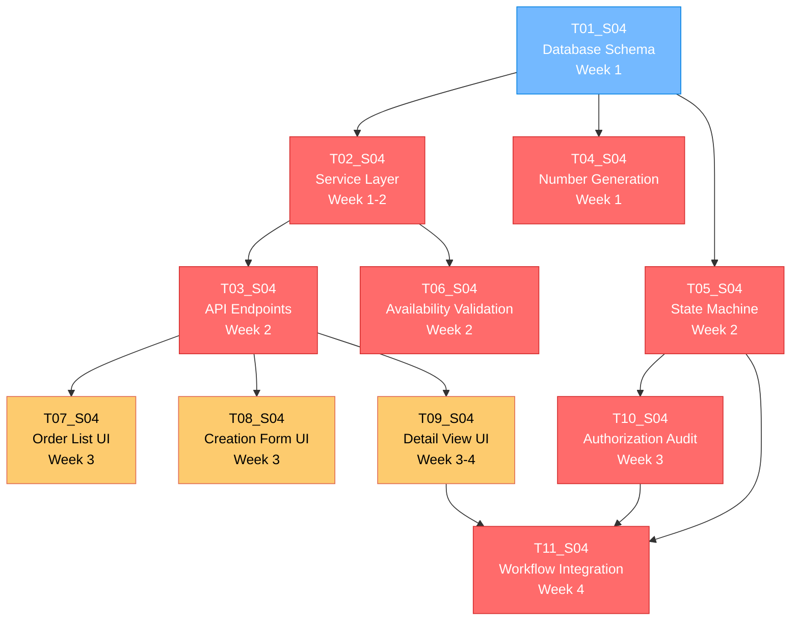

# S04_M02_Order_Processing - Task Execution Diagram

## Sprint Overview
**Sprint**: S04_M02_Order_Processing
**Total Tasks**: 11
**Average TDD Score**: 8.0/10
**Execution Strategy**: TDD-First Sprint
**Estimated Duration**: 3-4 weeks
**Team Size**: 3-4 developers

---

## Task Priority Matrix

### 🔴 High Priority TDD Tasks (Score >= 8)

| Task ID | Title | TDD Score | Complexity | Type | Dependencies |
|---------|-------|-----------|------------|------|-------------|
| T04_S04 | Order Number Generation System | 10/10 | Low | Business Logic | T01_S04 |
| T05_S04 | Order Status State Machine | 10/10 | Medium | Business Logic | T01_S04 |
| T02_S04 | Order Service Layer Implementation | 9/10 | Medium | Business Logic | T01_S04 |
| T10_S04 | Order Authorization Audit System | 9/10 | Medium-High | Infrastructure | T05_S04 |
| T11_S04 | Status Workflow Integration | 8.5/10 | Low | Infrastructure | T05_S04, T10_S04 |
| T03_S04 | Order API Endpoints | 8/10 | Medium | API/Integration | T02_S04 |
| T06_S04 | Product Availability Validation | 8/10 | Low | Business Logic | T02_S04 |

### 🟡 Medium Priority TDD Tasks (Score 5-7)

| Task ID | Title | TDD Score | Complexity | Type | Dependencies |
|---------|-------|-----------|------------|------|-------------|
| T08_S04 | Order Creation Form UI | 7.5/10 | Medium | UI/Frontend | T03_S04, T06_S04 |
| T07_S04 | Order Management UI List View | 6.5/10 | Medium | UI/Frontend | T03_S04 |
| T09_S04 | Order Detail View Edit UI | 6/10 | Medium | UI/Frontend | T03_S04, T11_S04 |
| T01_S04 | Order Database Schema Models | 6/10 | Medium | Data Layer | None |

---

## Execution Flow Diagram



---

## Parallel Execution Opportunities

### **Week 1: Foundation Phase**
**Parallel Development Tracks:**
- **Track A**: T01_S04 (Database Schema) - Database Team
- **Track B**: T04_S04 (Number Generation) + T02_S04 (Service Layer) - Backend Team
- **Track C**: TDD Infrastructure Setup + Test Templates - QA Team

**Synchronization Points:**
- End of Week 1: Database schema deployed, service layer patterns established
- **Deliverables**: Schema migrations, number generation service, basic CRUD operations

### **Week 2: Core Logic Phase**
**Parallel Development Tracks:**
- **Track A**: T05_S04 (State Machine) - Backend Specialist
- **Track B**: T03_S04 (API Endpoints) - API Team
- **Track C**: T06_S04 (Availability Validation) - Business Logic Team

**Synchronization Points:**
- Mid Week 2: State machine patterns established
- End of Week 2: API contracts finalized, validation rules implemented
- **Deliverables**: Complete order workflow API, status management system

### **Week 3: User Interface Phase**
**Parallel Development Tracks:**
- **Track A**: T10_S04 (Authorization Audit) - Security Team
- **Track B**: T07_S04 (Order List UI) + T08_S04 (Creation Form UI) - Frontend Team A
- **Track C**: T09_S04 (Detail View UI) - Frontend Team B

**Synchronization Points:**
- Mid Week 3: Authorization system integrated
- End of Week 3: UI components complete, security audit trails functional
- **Deliverables**: Complete order management interface, audit system

### **Week 4: Integration & Optimization Phase**
**Parallel Development Tracks:**
- **Track A**: T11_S04 (Workflow Integration) - Integration Team
- **Track B**: Performance testing and optimization - QA Team
- **Track C**: End-to-end testing and bug fixes - Full Team

**Synchronization Points:**
- End of Week 4: Complete order processing system ready for production
- **Deliverables**: Fully integrated system, performance benchmarks, deployment ready

---

## Critical Path Analysis

### **Longest Duration Path: 22 days**
```
T01_S04 (3d) → T02_S04 (5d) → T03_S04 (4d) → T09_S04 (6d) → T11_S04 (4d)
```

### **Bottleneck Identification:**
1. **T09_S04 (Order Detail View UI)** - Most complex UI component (6 days)
2. **T02_S04 (Service Layer)** - Foundation for multiple dependent tasks (5 days)
3. **T10_S04 (Authorization Audit)** - Security complexity requires careful implementation (5 days)

### **Optimization Strategies:**
1. **Early Start T04_S04**: Number generation can start immediately with T01_S04
2. **Parallel UI Development**: T07_S04 and T08_S04 can be developed simultaneously
3. **Split T09_S04**: Separate view and edit functionality into parallel work streams
4. **Prototype T10_S04**: Start authorization patterns early in Week 2

---

## Resource Allocation Strategy

### **Team Composition & Timeline**

#### **Backend Team (2 developers)**
- **Senior Backend Developer**: T02_S04, T05_S04, T10_S04 (TDD leadership)
- **Backend Developer**: T01_S04, T04_S04, T06_S04, T11_S04

#### **Frontend Team (2 developers)**
- **Senior Frontend Developer**: T08_S04, T09_S04 (complex forms and workflows)
- **Frontend Developer**: T07_S04 (data tables and list views)

#### **API/Integration Specialist (1 developer)**
- **Full-Stack Developer**: T03_S04, T11_S04 (API design and integration)

#### **QA/Test Engineer (1 specialist)**
- **Test Engineer**: TDD support, test infrastructure, performance testing

### **TDD Resource Distribution**
- **Mandatory TDD Tasks** (T02, T04, T05, T10): 60% of testing effort
- **High-Priority TDD Tasks** (T03, T06, T11): 25% of testing effort
- **Selective TDD Tasks** (T01, T07, T08, T09): 15% of testing effort

### **Skill Requirements**
- **TDD Expertise**: Required for T02_S04, T04_S04, T05_S04, T10_S04
- **State Machine Experience**: Critical for T05_S04
- **Security/RBAC Knowledge**: Essential for T10_S04
- **Complex Form Development**: Needed for T08_S04, T09_S04
- **Performance Testing**: Required for all tasks with timing constraints

---

## Risk Mitigation

### **High-Risk Dependencies**

#### **T05_S04 → T10_S04 Integration Risk**
- **Risk**: State machine and authorization system integration complexity
- **Mitigation**: Early prototyping, shared interface design, integration testing
- **Timeline Impact**: Could add 2-3 days if not properly coordinated
- **Early Warning**: Integration testing by Week 3 midpoint

#### **T02_S04 → Multiple Tasks Dependency Risk**
- **Risk**: Service layer delays impact 6 dependent tasks
- **Mitigation**: Interface-first development, mock implementations, parallel API design
- **Timeline Impact**: Critical path blocker, could delay sprint by 1 week
- **Early Warning**: Service layer interfaces defined by Week 1 end

#### **TDD Implementation Risk**
- **Risk**: Team inexperience with TDD could slow development
- **Mitigation**: TDD training, pair programming, test-first reviews
- **Timeline Impact**: 25-30% time increase in first 2 weeks
- **Early Warning**: Monitor test coverage and TDD adoption metrics

### **Performance Requirements Risk**
- **Risk**: Multiple tasks have strict timing requirements (<50ms, <100ms)
- **Mitigation**: Performance testing from Day 1, monitoring setup, optimization sprints
- **Timeline Impact**: Could require additional optimization iteration
- **Early Warning**: Performance benchmarks established by Week 2

### **UI Complexity Risk**
- **Risk**: T08_S04 and T09_S04 multi-step forms are complex
- **Mitigation**: UI prototyping, user testing, component library leverage
- **Timeline Impact**: Could extend Week 3-4 by 3-4 days
- **Early Warning**: Form validation patterns established by Week 2 end

---

## Success Metrics

### **TDD Implementation Targets**
- **Business Logic Tasks**: 95%+ test coverage (T02, T04, T05, T06, T10)
- **API/Integration Tasks**: 85%+ test coverage (T03, T11)
- **UI Logic Components**: 75%+ test coverage (T07, T08, T09)
- **Schema Validation**: 70%+ test coverage (T01)

### **Performance Benchmarks**
- **T04_S04**: Order number generation <50ms (100% compliance)
- **T05_S04**: Status transitions <50ms (100% compliance)
- **T06_S04**: Availability checks <100ms (95% compliance)
- **T11_S04**: Workflow transitions <100ms (95% compliance)

### **Quality Gates**
- **Code Review**: 100% coverage for all high-TDD tasks
- **Security Review**: Required for T10_S04 authorization system
- **Performance Review**: Required for all tasks with timing constraints
- **Integration Testing**: End-to-end workflow validation

### **Sprint Success Criteria**
1. **Functional**: Complete order processing workflow from creation to completion
2. **Performance**: All timing requirements met under load testing
3. **Security**: Authorization and audit systems fully operational
4. **Quality**: TDD targets achieved, test automation functional
5. **Integration**: Seamless integration with existing customer/product systems

### **Risk Tolerance**
- **Schedule**: 10% buffer (2-3 days) acceptable for quality
- **Scope**: Non-critical UI enhancements can be deferred
- **Performance**: 5% deviation from targets acceptable initially
- **Quality**: No compromise on security and audit requirements

---

## Post-Sprint Deliverables

### **Production Readiness**
- Complete order processing system deployed to staging
- Performance benchmarks documented and validated
- Security audit completed and approved
- Integration testing with existing systems completed

### **Documentation**
- API documentation for all order endpoints
- TDD patterns and test templates for future sprints
- Performance monitoring and alerting setup
- User training materials for order management interface

### **Technical Debt Assessment**
- Identify any shortcuts taken for timeline compliance
- Plan follow-up tasks for optimization and enhancement
- Document lessons learned for future TDD implementation
- Establish maintenance and support procedures
