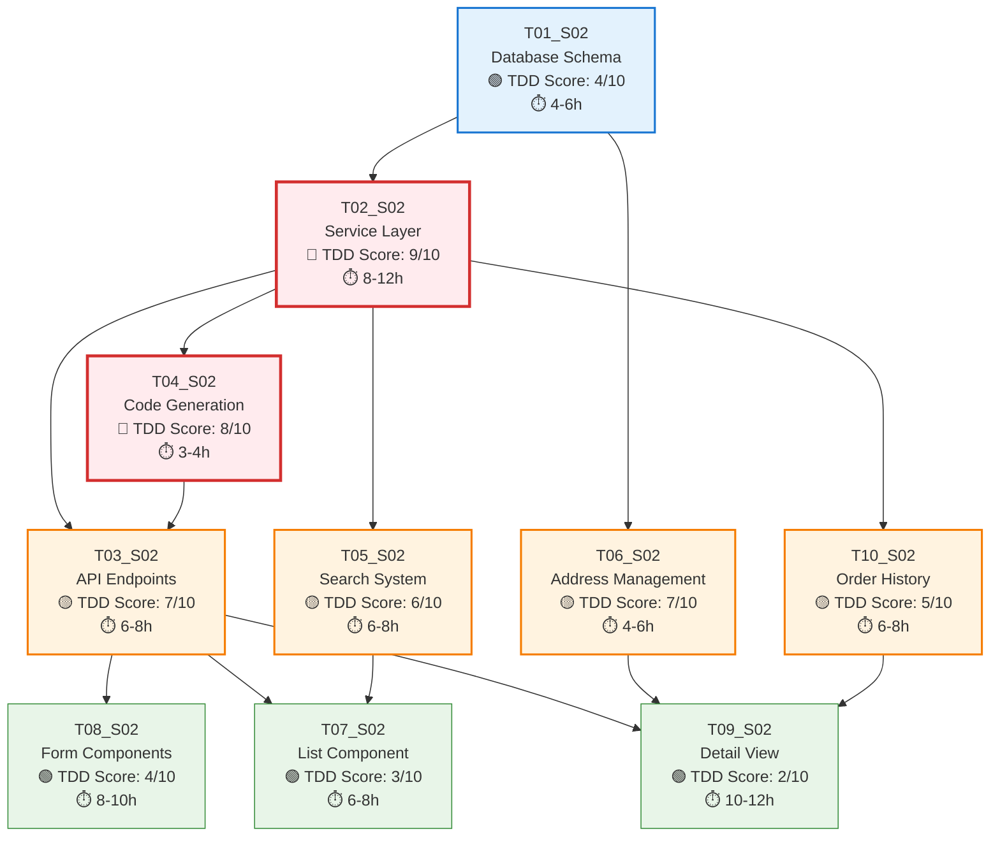

# S02_M02 Customer Management - Task Execution Diagram

## Sprint Overview
**Sprint**: S02_M02_Customer_Management
**Total Tasks**: 10
**Average TDD Score**: 5.5/10
**Execution Strategy**: Mixed Approach - Selective TDD Application

---

## Task Priority Matrix

### 🔴 High Priority TDD Tasks (Score >= 8)
| Task ID | Name | TDD Score | Complexity | Type | Dependencies |
|---------|------|-----------|------------|------|--------------|
| **T02_S02** | Customer Service Layer | 9/10 | Medium | Business Logic | T01_S02 |
| **T04_S02** | Customer Code Generation System | 8/10 | Low | Business Logic | T01_S02, T02_S02 |

### 🟡 Medium Priority TDD Tasks (Score 5-7)
| Task ID | Name | TDD Score | Complexity | Type | Dependencies |
|---------|------|-----------|------------|------|--------------|
| **T03_S02** | Customer API Endpoints | 7/10 | Medium | API/Integration | T02_S02, T04_S02 |
| **T06_S02** | Delivery Address Management | 7/10 | Low | Data Layer | T01_S02 |
| **T05_S02** | Customer Search Filter System | 6/10 | Medium | Infrastructure | T02_S02 |
| **T10_S02** | Customer Order History Integration | 5/10 | Low | Data Layer | T02_S02 |

### 🟢 Low Priority TDD Tasks (Score < 5)
| Task ID | Name | TDD Score | Complexity | Type | Dependencies |
|---------|------|-----------|------------|------|--------------|
| **T01_S02** | Customer Database Schema & Models | 4/10 | Medium | Infrastructure | None |
| **T08_S02** | Customer Form UI Components | 4/10 | Medium | UI/Frontend | T03_S02 |
| **T07_S02** | Customer List UI Component | 3/10 | Medium | UI/Frontend | T03_S02, T05_S02 |
| **T09_S02** | Customer Detail View UI | 2/10 | Medium-High | UI/Frontend | T03_S02, T06_S02, T10_S02 |

---

## Execution Flow Diagram



---

## Parallel Execution Opportunities

### 🚀 Phase 1: Foundation Setup (Days 1-2)
**Can Execute in Parallel:**
- ✅ **T01_S02** (Database Schema) - Independent foundation work
- ✅ **T06_S02** (Address Management) - Can start after T01_S02 schema is ready

**Sequential Requirement:**
- ❌ **T02_S02** (Service Layer) - Must wait for T01_S02 completion

### 🚀 Phase 2: Core Business Logic (Days 3-5)
**Can Execute in Parallel after T02_S02:**
- ✅ **T04_S02** (Code Generation) - Independent business logic
- ✅ **T05_S02** (Search System) - Independent search functionality
- ✅ **T10_S02** (Order History) - Independent data integration

**Team Assignment Strategy:**
- **Developer A**: T04_S02 (Code Generation) - 3-4 hours
- **Developer B**: T05_S02 (Search System) - 6-8 hours
- **Developer C**: T10_S02 (Order History) - 6-8 hours

### 🚀 Phase 3: API Integration (Days 6-7)
**Sequential Requirement:**
- ❌ **T03_S02** (API Endpoints) - Must wait for T02_S02, T04_S02 completion

### 🚀 Phase 4: UI Development (Days 8-12)
**Can Execute in Parallel after T03_S02:**
- ✅ **T08_S02** (Form Components) - Independent UI work
- ✅ **T07_S02** (List Component) - Requires T05_S02 for search integration

**Team Assignment Strategy:**
- **Frontend Developer A**: T08_S02 (Forms) - 8-10 hours
- **Frontend Developer B**: T07_S02 (List) - 6-8 hours

### 🚀 Phase 5: Advanced UI (Days 13-15)
**Sequential Requirement:**
- ❌ **T09_S02** (Detail View) - Must wait for T03_S02, T06_S02, T10_S02

---

## Critical Path Analysis

### 🎯 Critical Path (Longest Duration)
```
T01_S02 → T02_S02 → T03_S02 → T09_S02
(4-6h) + (8-12h) + (6-8h) + (10-12h) = 28-38 hours
```

### ⚡ Optimization Opportunities

1. **Parallel Development in Phase 2:**
   - While T02_S02 is being developed, T06_S02 can be completed
   - T04_S02, T05_S02, T10_S02 can start immediately after T02_S02

2. **UI Parallelization:**
   - T08_S02 and T07_S02 can be developed simultaneously
   - Different developers can work on different UI components

3. **Testing Overlap:**
   - Unit tests for completed components while others are in development
   - Integration testing can begin as soon as API layer is ready

---

## Resource Allocation Strategy

### 👥 Team Composition Recommendation
- **1 Backend Developer (Senior)**: T01_S02, T02_S02, T04_S02
- **1 Backend Developer (Mid)**: T03_S02, T05_S02, T10_S02
- **1 Full-stack Developer**: T06_S02, T08_S02
- **1 Frontend Developer**: T07_S02, T09_S02

### 📅 Sprint Timeline (3 Weeks)

#### Week 1: Foundation & Core Logic
- **Days 1-2**: T01_S02 (Database Schema)
- **Days 3-5**: T02_S02 (Service Layer) + T06_S02 (Address Management)
- **Days 6-7**: T04_S02, T05_S02, T10_S02 (Parallel execution)

#### Week 2: API & Basic UI
- **Days 8-9**: T03_S02 (API Endpoints)
- **Days 10-12**: T08_S02 + T07_S02 (Parallel UI development)

#### Week 3: Advanced UI & Integration
- **Days 13-15**: T09_S02 (Detail View)
- **Days 16-17**: Integration testing and bug fixes
- **Days 18-19**: Performance optimization and documentation
- **Day 20**: Sprint review and deployment

---

## Risk Mitigation

### ⚠️ High-Risk Dependencies
1. **T02_S02 → T03_S02**: Service layer delays impact API development
2. **T03_S02 → UI Components**: API delays impact all frontend work
3. **T09_S02 Integration**: Requires multiple completed components

### 🛡️ Mitigation Strategies
1. **Mock API Development**: Frontend can start with mock APIs
2. **Component Isolation**: Develop UI components with mock data
3. **Incremental Integration**: Test components as dependencies complete
4. **Buffer Time**: Add 20% buffer for high-complexity tasks

---

## Success Metrics

### 📊 TDD Implementation Targets
- **High Priority Tasks (T02, T04)**: 90%+ test coverage
- **Medium Priority Tasks (T03, T06, T05, T10)**: 70%+ test coverage
- **UI Tasks (T01, T07, T08, T09)**: 80%+ component test coverage

### ⏱️ Performance Targets
- **Search Operations**: <200ms response time
- **CRUD Operations**: <100ms response time
- **UI Rendering**: <2s initial load time
- **Test Suite**: <30s execution time

### 🎯 Quality Gates
- All high-priority TDD tasks must pass TDD-Guard validation
- API endpoints must pass integration tests
- UI components must pass accessibility tests
- Performance benchmarks must be met before deployment

---

**Generated**: 2025-08-14
**Sprint Duration**: 3 weeks (15 working days)
**Total Estimated Effort**: 65-85 hours
**Recommended Team Size**: 4 developers
