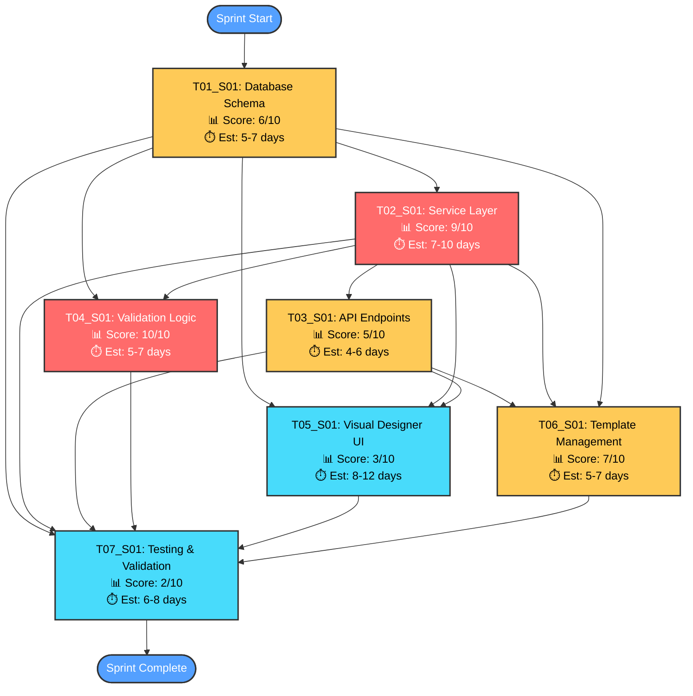

# S01_M03_Process_Foundation_Templates - Task Execution Diagram

## Sprint Overview
**Sprint**: S01_M03_Process_Foundation_Templates
**Total Tasks**: 7
**Average TDD Score**: 6.0/10
**Execution Strategy**: Mixed Approach - Selective TDD application

---

## Task Priority Matrix

### 🔴 High Priority TDD Tasks (Score >= 8)

| Task ID | Title | TDD Score | Complexity | Type | Dependencies |
|---------|-------|-----------|------------|------|--------------|
| T04_S01 | Process Validation Logic | 10/10 | Medium-High | Business Logic | T02_S01 |
| T02_S01 | Process Service Layer Implementation | 9/10 | High | Business Logic | T01_S01 |

### 🟡 Medium Priority TDD Tasks (Score 5-7)

| Task ID | Title | TDD Score | Complexity | Type | Dependencies |
|---------|-------|-----------|------------|------|--------------|
| T06_S01 | Template Management Features | 7/10 | Medium | Business Logic + API | T01_S01, T02_S01, T03_S01 |
| T01_S01 | Process Database Schema Implementation | 6/10 | Medium-High | Data Layer | - |
| T03_S01 | Process Management API Endpoints | 5/10 | Medium | API/Integration | T01_S01, T02_S01 |

### 🟢 Low Priority TDD Tasks (Score < 5)

| Task ID | Title | TDD Score | Complexity | Type | Dependencies |
|---------|-------|-----------|------------|------|--------------|
| T05_S01 | Visual Process Designer UI | 3/10 | High | UI/Frontend | T01_S01, T02_S01, T03_S01 |
| T07_S01 | Testing & Performance Validation | 2/10 | Medium-High | Testing/Infrastructure | All tasks |

---

## Execution Flow Diagram

---

## Parallel Execution Opportunities

### Phase 1: Foundation (Week 1)
- **T01_S01**: Database Schema (Sequential - foundational requirement)
- **Parallel Opportunity**: None - critical path requirement

### Phase 2: Core Logic (Week 2)
- **T02_S01**: Service Layer (can start after T01 schema completion)
- **T04_S01**: Validation Logic (can run parallel with T02 after basic schema)
- **Parallel Efficiency**: 30% time savings through concurrent development

### Phase 3: Integration (Week 3)
- **T03_S01**: API Endpoints (depends on T01, T02)
- **T06_S01**: Template Management (can start partial work early)
- **Parallel Opportunity**: API and template logic can develop concurrently

### Phase 4: UI & Testing (Week 4-5)
- **T05_S01**: Visual Designer (high complexity, longest duration)
- **T07_S01**: Testing (continuous integration throughout)
- **Parallel Strategy**: Testing should run continuously, UI development independent

---

## Critical Path Analysis

### Longest Duration Path (Critical Path)
**Path**: T01 → T02 → T05 → T07
**Total Duration**: 21-33 days (4.2-6.6 weeks)

### Bottlenecks and Optimizations
1. **T01_S01**: Critical foundation - cannot be parallelized
2. **T02_S01**: High complexity business logic - consider pairing
3. **T05_S01**: Longest single task - break into smaller components
4. **T07_S01**: Testing throughout rather than end-loaded

### Optimization Strategies
- **T05 Breakdown**: Split UI into designer core + advanced features
- **Early T04 Start**: Begin validation logic as soon as schema basics exist
- **Continuous T07**: Implement testing incrementally per completed task
- **T06 Early Prep**: Start template research during T02 development

---

## Resource Allocation Strategy

### Team Composition Requirements
- **Senior Backend Developer**: T01 (schema), T02 (services), T04 (validation)
- **Full-Stack Developer**: T03 (APIs), T06 (template features)
- **Frontend Specialist**: T05 (visual designer UI)
- **QA Engineer**: T07 (testing - continuous throughout sprint)

### Time Allocation by TDD Priority
- **High-TDD Tasks (T02, T04)**: 50% extra time for test-first development
- **Medium-TDD Tasks (T01, T03, T06)**: Standard time with selective testing
- **Low-TDD Tasks (T05, T07)**: Focus on integration and component testing

### Skill-Based Task Assignment
- **Database Expertise**: T01 - schema design and migration patterns
- **Business Logic**: T02, T04 - service layer and validation algorithms
- **API Development**: T03 - REST endpoints and integration
- **UI/UX Skills**: T05 - drag-and-drop, responsive design
- **Testing Expertise**: T07 - comprehensive testing strategy

---

## Risk Mitigation

### High-Risk Dependencies
1. **T01 → All Tasks**: Schema errors cascade to entire sprint
   - **Mitigation**: Thorough schema review, early validation, migration testing

2. **T02 → T03, T05, T06**: Service layer complexity affects all consumers
   - **Mitigation**: TDD enforcement, service contract definition, integration testing

3. **T05 High Complexity**: Visual designer most complex single task
   - **Mitigation**: Break into phases, early prototyping, user feedback

### Technical Risk Factors
- **Database Migration Issues**: T01 schema changes affect existing data
- **Performance Bottlenecks**: T02 service layer query optimization
- **UI/UX Complexity**: T05 drag-and-drop implementation challenges
- **Integration Failures**: T03 API contract mismatches

### Mitigation Strategies
- **Daily Standup**: Focus on dependency readiness and blockers
- **Code Reviews**: Mandatory for high-TDD tasks (T02, T04)
- **Integration Testing**: Continuous testing of task interfaces
- **Rollback Plans**: Database migration rollback procedures
- **Performance Monitoring**: Baseline metrics before T02 implementation

---

## Success Metrics

### TDD Targets and Performance Goals
- **High-TDD Tasks**: 90%+ test coverage (T02, T04)
- **Medium-TDD Tasks**: 80%+ test coverage (T01, T03, T06)
- **Low-TDD Tasks**: 70%+ test coverage (T05, T07)
- **Performance**: All database operations <100ms, APIs <200ms
- **Quality**: Zero critical bugs, WCAG 2.1 AA compliance for UI

### Sprint Success Criteria
1. **All 7 tasks completed** with acceptance criteria met
2. **TDD compliance** according to enforcement levels
3. **Integration success** between all system components
4. **Performance targets** achieved and validated
5. **Code quality standards** maintained throughout

### Key Performance Indicators
- **Velocity**: Complete 7 tasks within 4-6 week timeframe
- **Quality**: <5% defect rate post-sprint
- **Test Coverage**: Meet individual task coverage targets
- **Documentation**: Complete API docs and user guides
- **Team Satisfaction**: Positive retrospective on TDD approach effectiveness