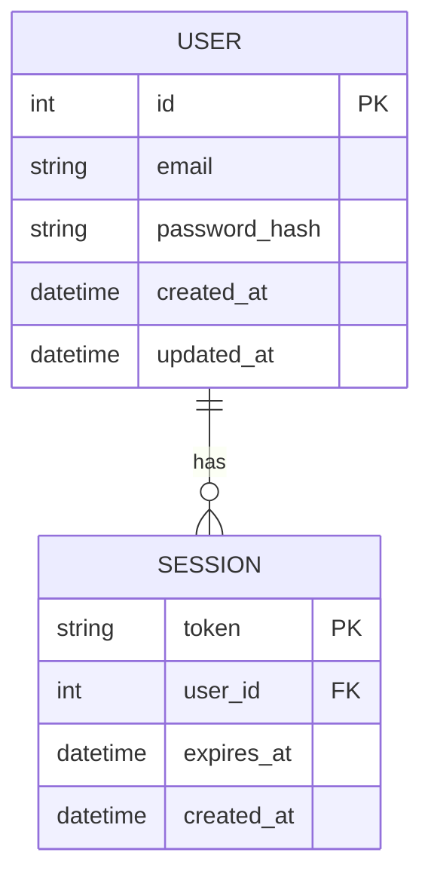
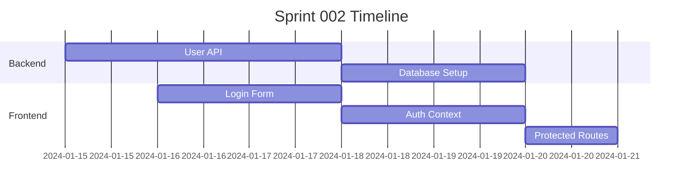

## Sprint Overview

This sprint focuses on implementing the user authentication flow and database schema.

## Architecture Diagram

<!DOCTYPE html>
<html>
<head>
    
</head>
<body>
    

        graph TD
            A[User Login] --> B[Validate Credentials]
            B --> C{Valid?}
            C -->|Yes| D[Generate JWT Token]
            C -->|No| E[Return Error]
            D --> F[Store Session]
            F --> G[Redirect to Dashboard]
            E --> H[Show Login Form]
    

    
</body>
</html>

## Database Schema

## Sprint Tasks

1. **User Authentication API**
   - Implement login endpoint
   - Implement logout endpoint
   - JWT token generation

2. **Database Setup**
   - Create user table
   - Create session table
   - Add indexes

3. **Frontend Integration**
   - Login form component
   - Authentication context
   - Protected routes

## Timeline

## Notes

- Focus on security best practices
- Ensure proper error handling
- Add comprehensive tests