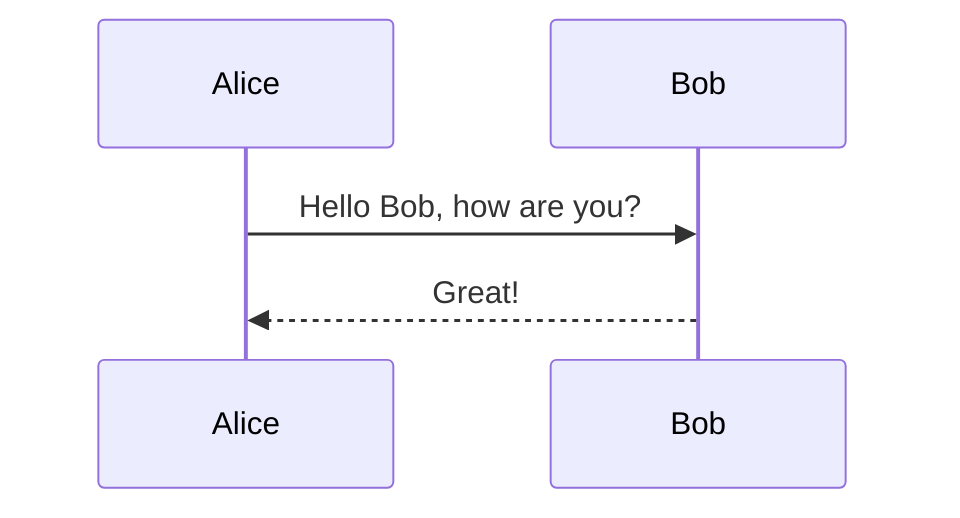
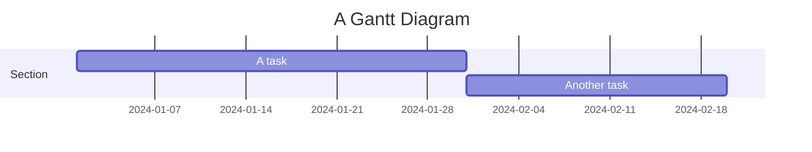

# Test Mermaid Integration

## Hướng dẫn test tính năng Mermaid

### 1. Khởi động server
```bash
backlog browser
```

### 2. Tạo sprint mới với Mermaid diagrams

Vào web interface và tạo một sprint mới với nội dung sau:

```markdown
---
id: sprint-test
title: Test Mermaid Diagrams
type: planning
created_date: 2024-01-15 10:00
---

## Test HTML Mermaid

<!DOCTYPE html>
<html>
<head>
    <script src="https://cdn.jsdelivr.net/npm/mermaid/dist/mermaid.min.js"></script>
</head>
<body>
    <div class="mermaid">
        graph TD
            A[Start] --> B[Process]
            B --> C[End]
    </div>
    <script>
        mermaid.initialize({ startOnLoad: true });
    </script>
</body>
</html>

## Test Standard Mermaid Code Block



## Test Gantt Chart


```

### 3. Các loại diagram được hỗ trợ

- **Flowchart**: `graph TD`, `graph LR`
- **Sequence Diagram**: `sequenceDiagram`
- **Gantt Chart**: `gantt`
- **Entity Relationship**: `erDiagram`
- **User Journey**: `journey`
- **Class Diagram**: `classDiagram`
- **State Diagram**: `stateDiagram`
- **Pie Chart**: `pie`

### 4. Features đã implement

✅ HTML-embedded Mermaid diagrams
✅ Standard markdown code blocks với ```mermaid
✅ Dark/Light theme support
✅ Error handling với detailed error messages
✅ Loading states
✅ Responsive design
✅ Multiple diagrams trong cùng một document

### 5. Test cases

1. **HTML format** (như bạn đã sử dụng)
2. **Standard markdown format**
3. **Mixed content** (markdown + mermaid)
4. **Multiple diagrams** trong cùng file
5. **Error handling** với invalid syntax
6. **Theme switching** (dark/light mode)